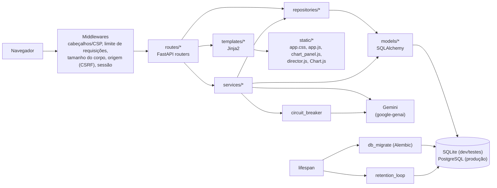
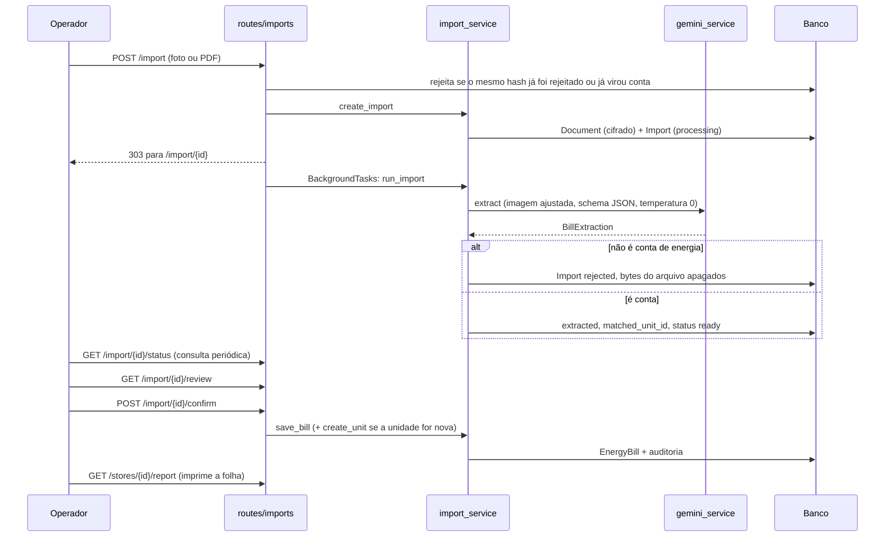

# Arquitetura do Sistema Economart Energia

Visão geral da arquitetura do controle de contas de energia. Para detalhes por área:

- [domain-model.md](domain-model.md) — papéis, regras de negócio, agrupamento do relatório, alertas
- [security.md](security.md) — autenticação, sessão, 2FA, criptografia dos documentos, auditoria
- [database.md](database.md) — tabelas, migrações Alembic, auditoria encadeada, backup
- [api-reference.md](api-reference.md) — rotas HTTP
- [frontend.md](frontend.md) — templates, CSS e JavaScript
- [operations.md](operations.md) — deploy no Railway, variáveis, incidentes
- [testing.md](testing.md) — suíte de testes
- [faq.md](faq.md) — perguntas frequentes

Nota: `security.md`, `api-reference.md`, `frontend.md`, `operations.md`, `testing.md` e `faq.md` ainda não
existem em `docs/`; os links acima são os destinos previstos. Hoje, além dos três documentos desta série
(`architecture.md`, `domain-model.md`, `database.md`), a pasta tem [OPERACAO.md](OPERACAO.md) (manual de
operação) e `APRESENTACAO.md`.

## Visão geral

O sistema recebe a foto ou o PDF de uma conta de energia, extrai os dados com o Gemini, mostra uma tela de
conferência e, ao confirmar, grava a conta no histórico da loja. Daí saem os gráficos por loja, a folha
impressa da loja e o painel da diretoria. Também aceita lançamento manual (contas digitadas e despesas sem
fatura, como gerador e LL Energia) e lançamento em lote (um valor para várias lojas).

É uma aplicação monolítica: FastAPI com páginas renderizadas no servidor (Jinja2), JavaScript simples no
navegador (sem build) e SQLAlchemy 2 sobre SQLite (desenvolvimento e testes) ou PostgreSQL (produção, Railway).
Não há API JSON separada para um frontend: as telas são formulários HTML com POST e redirecionamento. Os
poucos endpoints JSON existentes servem a gráficos, ao sino de vencimentos, ao contador de alertas e ao
acompanhamento do progresso da importação.

## Camadas

### routes (`app/routes/`)

Um módulo por área. Todos são registrados em `create_app()` (`app/main.py`).

| Módulo | Área |
|---|---|
| `auth.py` | login, segundo fator (`/login/2fa`), logout |
| `account.py` | troca de senha, configuração do 2FA (somente administrador) |
| `dashboard.py` | página inicial (`/`); a diretoria é redirecionada para `/diretoria` |
| `director.py` | painel da diretoria e exportação CSV |
| `stores.py` | lojas, unidades consumidoras, histórico da loja, folha impressa (`/stores/{id}/report`) |
| `bills.py` | lista única de contas e lançamentos (`/notas`) e CSV |
| `imports.py` | upload, progresso, conferência e confirmação da importação |
| `manual.py` | lançamento manual (conta ou despesa), exclusões, ficha de impressão da conta (`/bills/{id}/print`) |
| `manual_batch.py` | lançamento em lote (`/manual/lote`) |
| `points.py` | cadastro rápido de ponto de energia e lembretes de vencimento (`/api/due`) |
| `types.py` | tipos de registro |
| `charts.py` | dados do gráfico da loja (`/api/stores/{id}/chart`) |
| `alerts.py` | Central de Alertas (`/alertas`) |
| `documents.py` | entrega do arquivo original e das páginas do PDF como PNG |
| `admin.py` | usuários e auditoria (somente administrador) |
| `help.py` | página de ajuda (`/ajuda`) |

Autorização é feita por dependências de `app/security.py`: `current_user`, `writer_required`,
`director_required`, `admin_required` e `alerts_required`. Rotas que alteram dados também declaram
`Depends(verify_csrf)`.

### services (`app/services/`)

Regra de negócio e cálculo. Os serviços recebem a `Session` e devolvem estruturas (dataclasses, dicts) ou
modelos; não geram HTML. Lista na seção [Serviços principais](#serviços-principais).

### repositories (`app/repositories/`)

Camada pequena de consultas reutilizadas:

- `records.py`: contas por unidade e período (`bills_for_units`), lançamentos manuais por loja
  (`manual_for_store`), mês mais recente e mais antigo com dados (`latest_reference`, `earliest_reference`).
- `stores.py`: lojas, unidades, tipos de registro e tipo de conta padrão (`default_bill_type`).

Boa parte das consultas dos serviços (alertas, painel, lista `/notas`) usa `select` direto, sem passar por aqui.

### models (`app/models/`)

Onze tabelas de aplicação mais `alembic_version`: `users`, `stores`, `consumer_units`, `record_types`,
`documents`, `imports`, `energy_bills`, `manual_records`, `audit_log`, `login_throttle`, `alert_acks`.
Descrição completa em [database.md](database.md).

### templates (`app/templates/`)

Jinja2, com `base.html` (menu por perfil, avisos, diálogo de cadastro de ponto) e `macros.html`. Uma pasta por
área (`stores/`, `imports/`, `manual/`, `bills/`, `director/`, `alerts/`, `admin/`, `account/`, `points/`,
`types/`, `units/`, `partials/`). `app/web.py` configura o ambiente Jinja2, os filtros (`brl`, `num`, `pct`,
`month_label`, `date_br`, `dt_br`) e o helper `render()`, que injeta o token CSRF, o nonce da CSP, as mensagens
`flash` e o caminho atual.

### static (`app/static/`)

`css/app.css` (tokens em `:root`), `js/app.js` (comportamentos globais sem JavaScript inline),
`js/chart_panel.js` (gráfico da loja), `js/director.js` (painel da diretoria) e `js/vendor/chart.umd.min.js`
(Chart.js local). O `app/web.py` calcula uma versão (`ASSET_VERSION`, hash de `app.css`, `app.js`,
`chart_panel.js` e `director.js`) usada para derrubar o cache do navegador.

## Inicialização (`lifespan`)

1. `create_app()` chama `security_problems()` (`app/startup_checks.py`). Com `DEBUG=false`, recusa subir se
   `SECRET_KEY` for ausente, curta (menos de 32 caracteres) ou conhecida, se `DOCUMENT_ENCRYPTION_KEY` for ausente ou
   inválida, ou se `DATABASE_URL` apontar para SQLite.
2. No `lifespan`: se `RUN_MIGRATIONS` for verdadeiro (padrão), `db_migrate.upgrade()` aplica as migrações
   Alembic; caso contrário, `Base.metadata.create_all()` e `ensure_columns()` (usado nos testes). Detalhes em
   [database.md](database.md#migrações-alembic).
3. `seed(db)` cria os tipos de registro padrão (se não existirem) e o administrador inicial, quando não há nenhum
   usuário e `ADMIN_PASSWORD` está definido. Em produção a senha precisa ter 12 caracteres ou mais.
4. Dispara `retention_loop()` como tarefa assíncrona; é cancelada no encerramento.

Também em `create_app()`: a documentação automática do FastAPI está desligada (`docs_url`, `redoc_url`,
`openapi_url` = `None`), há handlers para `LoginRequired` (redireciona para `/login`), `MustChangePassword`
(redireciona para `/account/password`), `MustSetup2FA` (redireciona para `/account/2fa`), `HTTPException`
(página de erro para quem aceita HTML, texto puro nos demais casos) e `Exception` (página 500 genérica, com
o detalhe só no log).

## Fluxo principal: da fatura à folha impressa

Passo a passo:

1. **Upload** (`POST /import`, perfis com escrita). O arquivo é lido até o limite configurado
   (`MAX_UPLOAD_MB`, padrão 12) mais 1 byte. Antes de criar a importação, a rota consulta o hash SHA-256:
   se um arquivo idêntico já foi rejeitado como "não é conta de energia", ou já virou uma conta salva, responde 409 e
   não chama o Gemini.
2. **Validação** (`utils/uploads.validate_upload`). Extensão permitida (jpg, jpeg, png, webp, pdf), conteúdo
   conferido pelos primeiros bytes (não confia na extensão nem no `Content-Type`), PDF com no máximo 10 páginas e nome
   de arquivo saneado.
3. **Armazenamento.** O arquivo é cifrado (Fernet, `crypto_service`) e gravado em `documents.data`, no
   próprio banco. Cria-se um registro `imports` com `status = processing`.
4. **Extração em segundo plano** (`run_import`, via `BackgroundTasks` do FastAPI, em sessão própria). Um
   semáforo (`GEMINI_MAX_CONCURRENCY`, padrão 2) limita chamadas simultâneas. A imagem é corrigida (rotação EXIF) e
   reduzida se for grande (`utils/images.prepare_for_model`); PDFs seguem como estão. O Gemini recebe o
   schema `BillExtraction` como resposta estruturada, temperatura 0 e até 3 tentativas para 429/5xx e falhas
   transitórias de rede. O prompt inclui o catálogo de lojas com apelidos, usado só para normalizar anotações
   escritas à mão.
5. **Rejeição.** Se a IA disse que não é conta de energia, ou nada que identifique uma conta foi lido, a
   importação vira `rejected` e os bytes do arquivo são apagados na hora. Ver
   [domain-model.md](domain-model.md#rejeição-de-documentos-que-não-são-conta-de-energia).
6. **Identificação da unidade.** `find_unit_by_number` compara o número da unidade consumidora normalizado (só
   dígitos) com `consumer_units.number_normalized`. O resultado vai para `imports.matched_unit_id` e o status
   para `ready`.
7. **Acompanhamento.** A tela de progresso consulta `GET /import/{id}/status`. Uma importação `processing`
   parada por mais de `STALE_IMPORT_MINUTES` (padrão 10) vira `failed`, com opção de "Tentar novamente".
8. **Conferência** (`GET /import/{id}/review`). Mostra os campos lidos, destaca os de baixa confiança
   (limite 0,85), sugere unidades parecidas (distância de edição até 2) quando a unidade lida não existe e
   avisa quando a anotação à mão aponta outra loja ou o tipo da distribuidora não bate com o cadastro.
9. **Salvar** (`POST /import/{id}/confirm`). Revalida tudo no servidor (`parse_bill_form`). A unidade pode ser a
   identificada, uma existente escolhida à mão ou nova (`create_unit`). Se já existe conta da mesma unidade
   no mesmo mês, ou com o mesmo número de nota, a rota responde 409 e pede a decisão: substituir ou manter as
   duas. `save_bill` grava a `EnergyBill`, preenche `consumer_units.due_day` a partir do vencimento se a unidade
   ainda não tinha, e registra a auditoria (`create` ou `replace`, com antes/depois). A rota termina em
   redirecionamento para `/stores/{id}`.
10. **Folha da loja impressa** (`GET /stores/{id}/report`, `chart_service.report_data`). Resumo de todos os
    fornecedores mais um fornecedor com gráfico, variação, tabela por unidade e dados da última conta. É o
    equivalente da planilha original; regras de agrupamento em
    [domain-model.md](domain-model.md#agrupamento-do-relatório). A ficha de uma conta isolada fica em
    `/bills/{id}/print` e pode incluir o original; PDFs são convertidos em PNG por página
    (`pdf_pages`, máximo 6 páginas) porque o navegador não imprime PDF embutido.

## Lançamento manual e em lote

Os dois fluxos existem para o que não vem de uma foto ou para quando a leitura falha.

**Manual, loja a loja** (`/manual`, `manual.py`). A tela inicial só pergunta o tipo de lançamento; o formulário
individual abre depois. Depende do tipo de registro:

- Tipo com `kind = bill` (distribuidoras): exige loja e unidade consumidora, usa os mesmos campos da conta
  importada e grava `EnergyBill` com `source = manual` (`save_bill`).
- Tipo com `kind = manual`: grava `ManualRecord` (loja, mês de referência, valor, vencimento opcional, campos
  numéricos definidos em `record_types.fields`, observações).
- Tipos "só em lote" (`RecordType.is_batch_only`, hoje o código `ll-energia`) são recusados no formulário
  individual, exceto para editar um lançamento já existente.
- Duplicidade (mesma unidade e mesmo mês, ou mesmo número de nota; para manual, mesma loja, unidade, tipo e
  mês) responde 409 com a escolha "substituir" ou "criar novo".

**Em lote** (`/manual/lote`, `manual_batch.py`). Um valor e um mês para várias lojas ativas marcadas. Grava um
`ManualRecord` por loja, sem unidade (`unit_id = NULL`), todos com um identificador de lote (8 caracteres) no
detalhe da auditoria. Se alguma loja já tem lançamento daquele tipo no mês, responde 409 e pede "pular" ou
"substituir". Ao final redireciona para `/notas` filtrado pelo tipo e pelo mês.

O lançamento manual vale sempre pelo mês de referência informado; o vencimento é opcional e informativo
(ver [domain-model.md](domain-model.md#lançamento-manual)).

## Serviços principais

| Serviço | Responsabilidade |
|---|---|
| `import_service` | ciclo da importação: `create_import`, `run_import`, rejeição, expiração de importações paradas, `create_unit`, `save_bill` |
| `gemini_service` | única integração com o Gemini (prompt, retentativas, mensagens de erro em português, parse tolerante do JSON) |
| `extraction_service` | escolhe o extrator: Gemini ou `MockExtractor` (fixture JSON, `EXTRACTION_PROVIDER=mock`) |
| `circuit_breaker` | disjuntor em processo para o Gemini: abre após 5 falhas seguidas do lado do Google, rejeita por 30 s, depois deixa passar uma chamada de teste |
| `matching_service` | busca unidade pelo número, sugere unidades parecidas, resolve loja por anotação à mão, tipo por distribuidora |
| `duplicate_service` | detecta conta ou lançamento manual duplicado |
| `chart_service` | séries do gráfico da loja, resumo mensal, folha impressa (`report_data`), ficha de uma conta (`bill_print_data`) |
| `executive_service` | painel da diretoria: totais, comparação entre lojas, mix por tipo, R$/kWh, uso da demanda contratada, frases de destaque |
| `dashboard_service` | resumo da página inicial e pendências do mês |
| `alert_service` | Central de Alertas, regras em [domain-model.md](domain-model.md#central-de-alertas) |
| `due_service` | lembretes de vencimento por unidade (dia do mês) |
| `calculation_service` | variação percentual e aritmética de meses |
| `audit_service` | registro de auditoria com cadeia de hash e verificação |
| `auth_service` | login com bloqueio por tentativas, senha provisória, segundo fator, revogação de sessões |
| `totp_service` | 2FA por TOTP (RFC 6238) para administradores, com códigos de recuperação |
| `crypto_service` | cifra e decifra os documentos (Fernet/MultiFernet) |
| `pdf_pages` | renderiza páginas de PDF como PNG (pypdfium2) para a impressão da conta |
| `retention_service` | remoção dos arquivos originais após o prazo de retenção |

## Middleware

Registrados em `create_app()`. O último `add_middleware` é o mais externo; a ordem efetiva de uma requisição é
`SecurityHeaders` → `RateLimit` → `BodySizeLimit` → `CSRFOrigin` → `Session` → rota.

- **SecurityHeadersMiddleware.** Gera um nonce por resposta (`request.state.csp_nonce`) e define
  `X-Content-Type-Options`, `X-Frame-Options: SAMEORIGIN`, `Referrer-Policy`, `Permissions-Policy`,
  `Cross-Origin-Opener-Policy`, `Cross-Origin-Resource-Policy` e, fora de `DEBUG`, `Strict-Transport-Security`. A CSP
  é `default-src 'self'; script-src 'self' 'nonce-…'; style-src 'self' 'unsafe-inline'; img-src 'self' data: blob:;
  connect-src 'self'; frame-src 'self'; object-src 'none'; base-uri 'self'; form-action 'self'; frame-ancestors
  'self'`. Scripts inline só funcionam com o nonce, que o `render()` entrega aos templates como `csp_nonce`. A
  CSP não é definida para caminhos que começam com `/documents/`; a rota define a sua própria para imagens
  (`default-src 'none'; … sandbox`). Respostas fora de `/static/` recebem `Cache-Control: no-store`.
- **RateLimitMiddleware.** Janela deslizante em memória, por processo e por IP (`client_ip`, que respeita
  `TRUSTED_PROXY_COUNT`). Políticas: login 10/60 s, login 2FA 10/60 s, troca de senha 10/600 s, upload (`POST /import`)
  20/60 s, `GET /documents/*` 60/60 s, `GET /api/*` 240/60 s, demais mutações 120/60 s. Resposta 429 com
  `Retry-After`. Desligável com `RATE_LIMIT_ENABLED=false`. Vale para uma instância; com várias seria preciso
  um armazenamento compartilhado (o código cita Redis; não existe no repositório).
- **BodySizeLimitMiddleware.** Em métodos que alteram dados, recusa com 413 corpos acima de 1 MB, ou acima do
  limite de upload mais 1 MB em `POST /import`, olhando o `Content-Length`.
- **CSRFOriginMiddleware.** Segunda camada de proteção contra CSRF: recusa mutações com
  `Sec-Fetch-Site: cross-site`, com `Origin: null` ou com `Origin` diferente do `Host` (salvo origens extras em
  `CSRF_ALLOWED_ORIGINS`). A primeira camada é o token de sessão conferido por `verify_csrf` em cada rota
  (cabeçalho `X-CSRF-Token` ou campo `csrf_token`).
- **SessionMiddleware** (Starlette). Cookie `energia_session` assinado com `SECRET_KEY`, `SameSite=strict`, `Secure`
  fora de `DEBUG`, duração `SESSION_MAX_HOURS` (padrão 12). A sessão guarda `uid`, `epoch`, `iat`, `seen` e o token
  CSRF. `current_user` invalida a sessão se o usuário foi desativado, se a "época" mudou (logout, troca de senha,
  mudança de perfil), se passou a duração máxima absoluta ou o tempo de inatividade (`SESSION_IDLE_MINUTES`, 60).

Mais detalhes em [security.md](security.md).

## Tarefas de retenção

`retention_loop()` roda na subida e depois a cada `RETENTION_CHECK_HOURS` (padrão 6). Em cada passada,
`purge_expired_documents` seleciona `documents` com `data` preenchido e `created_at` anterior a
`DOCUMENT_RETENTION_DAYS` (padrão 183), zera `data`, grava `purged_at` e registra uma linha de auditoria
`purge` com a contagem. Os dados lidos da conta permanecem. Falhas são logadas e não derrubam o aplicativo.
Execução manual: `python -m scripts.purge_documents`. A rejeição de um arquivo que não é conta apaga os bytes na
hora, sem esperar o prazo.

Outras limpezas oportunistas, sem tarefa própria: `auth_service` remove registros antigos de `login_throttle`
(mais de 1 dia) quando cria um novo.

## Health check

`GET /health` executa `SELECT 1` e devolve `ok` (200) ou `banco indisponível` (503). É o `healthcheckPath` do
`railway.json`; o Railway só promove o deploy se responder 200. Não existem `/health/live` nem
`/health/ready` neste sistema. O comando de início é `uvicorn app.main:app --host 0.0.0.0 --port $PORT`
(`railway.json` e `Procfile`).

## Observabilidade

- Logs em Python `logging`. `install_log_redaction` (`utils/log_safety.py`) mascara chaves de API do Google
  (a `GEMINI_API_KEY` configurada e padrões `AIza…`, `x-goog-api-key`, `?key=`) em mensagens e tracebacks.
- A auditoria no banco (`audit_log`) é o registro de negócio e de segurança; ver
  [database.md](database.md#cadeia-de-hash-da-auditoria).
- Não há identificador de requisição nem métricas expostas. Não verificado se há integração com algum
  serviço externo de monitoramento além do Railway.

## Decisões de arquitetura

- **Arquivo original no banco, cifrado.** O disco do Railway é efêmero. O banco carrega os arquivos; o
  backup do banco leva junto, mas só abre com `DOCUMENT_ENCRYPTION_KEY`.
- **Extração em segundo plano no próprio processo.** Sem fila externa. Se o processo reinicia durante a
  extração, a importação fica `processing` até a expiração por inatividade e pode ser reenviada com "Tentar
  novamente".
- **Alembic com adoção de banco anterior.** Ver [database.md](database.md#adoção-de-banco-anterior-ao-alembic).
- **Estado de limite de requisições, disjuntor e cache do contador de alertas em memória do processo.** Servem
  a uma instância.
- **Horário de negócio em America/Sao_Paulo.** O banco guarda instantes em UTC; "hoje" e os vencimentos usam
  `utils/timezone.local_today`.
