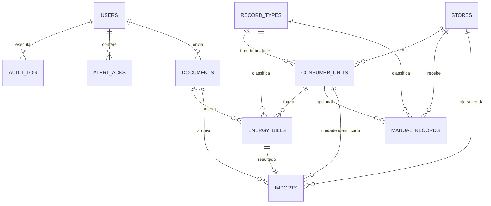

# Banco de dados

Tabelas, relações, índices, migrações Alembic, diferenças entre SQLite e PostgreSQL, cadeia de hash da auditoria
e backup. Contexto de negócio em [domain-model.md](domain-model.md); camadas em
[architecture.md](architecture.md).

## Stack

- **Produção:** PostgreSQL (Railway). O driver é o `psycopg` 3; `DATABASE_URL` com `postgres://` ou
  `postgresql://` é reescrita para `postgresql+psycopg://` (`app/config`).
- **Desenvolvimento e testes:** SQLite. O padrão de `DATABASE_URL` é `sqlite:///app.db`. A suíte usa um arquivo
  temporário (ou `TEST_DATABASE_URL`, se definido).
- **ORM:** SQLAlchemy 2.x (`Mapped`/`mapped_column`). Sessão sem `autoflush` e sem expiração no commit
  (`app/database.py`).
- **Migrações:** Alembic, em `migrations/`, aplicadas por `app/db_migrate.py`.

Com `DEBUG=false` o servidor se recusa a subir com SQLite (`app/startup_checks.py`), porque o disco do Railway é
efêmero.

## Tabelas

Chaves primárias são inteiros autoincrementais. Todas as tabelas com `created_at`/`updated_at` usam
`TimestampMixin` (`DateTime` com fuso, preenchidos em UTC pela aplicação). As chaves estrangeiras não declaram
`ON DELETE`; a exclusão de uma loja não é exposta na interface (lojas e unidades são desativadas, não removidas).



`users` também é referenciada por `created_by`/`updated_by` em `energy_bills`, `manual_records` e `imports`
(`created_by`).

### users

Quem pode entrar no sistema.

- `id`, `username` (varchar 80, único), `password_hash` (varchar 255; formato `scrypt$N$salt$digest`).
- `role` (varchar 20, padrão `operator`): `admin`, `operator`, `director`, `viewer`; `user` é legado.
- `active` (boolean).
- `must_change_password` (boolean, anulável), `temp_expires_at` (validade da senha provisória),
  `password_changed_at`.
- `failed_attempts`, `blocked_until`: bloqueio por tentativas erradas.
- `last_login`.
- `session_epoch` (inteiro): incrementa em logout, troca de senha, mudança de perfil e desativação; sessões com
  época antiga deixam de valer.
- 2FA (só administradores): `totp_secret` (texto, cifrado com a chave dos documentos quando existe),
  `totp_enabled`, `totp_last_step` (anti-replay), `totp_recovery` (JSON com hashes SHA-256 dos 8 códigos de
  recuperação).
- Índices: `username` (único, pela constraint).

### stores

- `code` (varchar 40, único), `name`, `location`, `region` (varchar 20, UF), `notes`, `aliases` (JSON, lista de
  apelidos), `active`.

### consumer_units

Unidade consumidora (ponto de energia).

- `store_id` (FK `stores`, indexada), `record_type_id` (FK `record_types`, anulável), `number` (varchar 40, como
  impresso), `number_normalized` (varchar 40, só dígitos, **índice único**), `internal_code`, `description`, `notes`.
- `due_day` (inteiro, dia do mês do vencimento) e `due_ack` (data da última ocorrência de vencimento tratada).
- `active`.
- Relação com `stores` no ORM: `cascade="all, delete-orphan"`.

### record_types

- `code` (varchar 40, único), `name` (varchar 120), `kind` (`bill` ou `manual`), `description`.
- `fields` (JSON): campos numéricos extras, no formato `[{"key": "horas", "label": "Horas", "unit": "h"}]`.
- `aliases` (JSON): nomes alternativos da distribuidora, como aparecem na conta.
- `sort_order` (inteiro), `active`.

### documents

O arquivo original enviado (foto ou PDF), guardado no próprio banco.

- `filename` (varchar 255), `content_type` (varchar 100), `size`, `sha256` (varchar 64, **indexado**).
- `data` (`LargeBinary`, anulável): bytes cifrados com Fernet; `NULL` depois da retenção ou da rejeição.
- `encrypted` (boolean): `false` em documentos gravados antes de a chave existir.
- `purged_at`: quando a retenção removeu os bytes.
- `uploaded_by` (FK `users`).

### imports

Uma tentativa de importação de conta.

- `document_id` (FK `documents`), `store_hint_id` (FK `stores`, loja escolhida no upload), `matched_unit_id` (FK
  `consumer_units`), `bill_id` (FK `energy_bills`, preenchido ao confirmar), `created_by`.
- `status` (varchar 20, **indexado**): `processing`, `ready`, `confirmed`, `cancelled`, `failed`, `rejected`.
- `stage`: `received`, `extracting`, `matching`, `done` (usado só para o feedback visual).
- `error` (texto), `extracted` (JSON com a resposta da IA, sem alterações), `provider` (nome do extrator, por
  exemplo `gemini:<modelo>` ou `mock`).

### energy_bills

Conta de uma unidade em um mês.

- `unit_id` (FK `consumer_units`, indexada), `record_type_id` (FK, indexada), `document_id` (FK, anulável),
  `source` (`import` ou `manual`).
- `reference` (data, **indexada**; sempre dia 1, garantido por `parse_reference` na aplicação, sem constraint no
  banco), `issue_date`, `due_date`, `invoice_number` (varchar 60), `series`.
- `total_value` (`Numeric(14,2)`, obrigatório).
- Leitura: `days`, `previous_reading_date`, `current_reading_date`, `next_reading_date`.
- Consumo (`Numeric(14,3)`): `consumption_hp`, `consumption_hfp`, `consumption_kwh` (único, sem ponta/fora de
  ponta), `consumption_hr`.
- Demanda (`Numeric(14,3)`): `demand_hp`, `demand_hfp`, `contracted_demand`.
- Impostos (`Numeric(14,2)`): `pis_cofins_value`, `icms_value`.
- Classificação: `bill_class`, `subclass`, `tariff_modality`.
- `line_items` (JSON, lista de itens faturados), `notes` (varchar 2000).
- `created_by`, `updated_by` (FK `users`).
- Não há unicidade por (unidade, mês) nem por número de nota: duplicidade é tratada pelo `duplicate_service`.
- `POST /manual/bills/{id}/delete` zera `imports.bill_id` antes de excluir a conta (`update(Import)...`), porque no PostgreSQL a chave
  estrangeira impede excluir uma conta que uma importação confirmada ainda referencia. Em SQLite a FK não é imposta, então
  o teste `test_deleting_a_bill_that_came_from_an_import_releases_the_import` confere o efeito (a importação fica com `bill_id` nulo).

### manual_records

Lançamento mensal manual.

- `store_id` (FK, indexada), `unit_id` (FK, anulável; em lote fica nulo), `record_type_id` (FK, indexada),
  `reference` (data, **indexada**), `due_date` (opcional, só informativa), `value` (`Numeric(14,2)`).
- `data` (JSON): valores dos campos extras do tipo, por `key`.
- `notes` (varchar 2000), `created_by`, `updated_by`.
- Não há unicidade por (loja, unidade, tipo, mês); o `duplicate_service` trata.
- A revisão 0003 chegou a criar a coluna `accounting_date` nesta tabela em produção; ela não existe nos modelos
  (ver [revisão 0003](#por-que-a-revisão-0003-permanece)).

### audit_log

Registro de auditoria encadeado.

- `at` (data/hora com fuso, **indexada**), `user_id` (FK `users`, anulável), `action` (varchar 40), `entity`
  (varchar 40), `entity_id` (inteiro, anulável), `details` (JSON).
- `prev_hash`, `row_hash` (varchar 64, anuláveis): ver [cadeia de hash](#cadeia-de-hash-da-auditoria).

### login_throttle

Falhas de login com nome de usuário que **não existe**, para que o bloqueio pareça igual com usuário real ou
inventado e a mensagem não revele quais usuários existem.

- `key` (varchar 40, **índice único**): HMAC do nome digitado (o nome bruto não é guardado), `failures`,
  `blocked_until`.
- Registros com mais de um dia sem atualização são apagados quando um novo é criado.

### alert_acks

Alertas já conferidos (migração 0002).

- `key` (varchar 80, **índice único**): `tipo:id-da-conta`, `by_user` (FK `users`, anulável), `at`
  (data/hora, padrão agora), `note` (varchar 300; a rota atual não preenche).

### alembic_version

Criada pelo Alembic; guarda a revisão atual (`version_num`).

## Índices (resumo)

| Tabela | Índices |
|---|---|
| `users` | `username` (único) |
| `stores` | `code` (único) |
| `record_types` | `code` (único) |
| `consumer_units` | `store_id`; `number_normalized` (único) |
| `documents` | `sha256` |
| `imports` | `status` |
| `energy_bills` | `unit_id`, `record_type_id`, `reference` |
| `manual_records` | `store_id`, `record_type_id`, `reference` |
| `audit_log` | `at` |
| `login_throttle` | `key` (único) |
| `alert_acks` | `key` (único) |

Não há índice composto. As consultas mais frequentes (`bills_for_units`, `manual_for_store`) filtram por unidade ou
loja mais um intervalo de `reference`; o desempenho com esses índices simples não foi medido neste documento.

## Migrações (Alembic)

### Arquivos

| Revisão | Arquivo | O que faz |
|---|---|---|
| `0001` | `0001_baseline.py` | Baseline gerado automaticamente a partir dos modelos: cria `login_throttle`, `record_types`, `stores`, `users`, `audit_log`, `consumer_units`, `documents`, `energy_bills`, `manual_records`, `imports` e seus índices. |
| `0002` | `0002_alert_acks.py` | Cria `alert_acks` e o índice único em `key`. Tem uma guarda: se a tabela já existe (banco criado com o modelo atual), não faz nada. |
| `0003` | `0003_manual_accounting_date.py` | **Sem alterações de esquema.** `upgrade()` e `downgrade()` são `pass`. |

`migrations/env.py` usa os modelos de `app` e o mesmo `DATABASE_URL`, com `compare_type=True` e
`render_as_batch` quando o banco é SQLite. Aceita uma conexão já aberta (`config.attributes["connection"]`),
que é como `db_migrate` o chama; o modo offline não é suportado.

### Por que a revisão 0003 permanece

A 0003 foi aplicada em bancos de produção: criava a coluna `manual_records.accounting_date`, que depois foi
abandonada (o lançamento manual vale pelo mês de referência, ver
[domain-model.md](domain-model.md#lançamento-manual)). A revisão foi removida do repositório e, em
2026-10-10, a produção deixou de subir com `Can't locate revision identified by '0003'`: o banco estava carimbado
em `0003` em `alembic_version`, e o Alembic não encontrava o arquivo.

Por isso a 0003 voltou, esvaziada, e **deve permanecer na cadeia**. A coluna `accounting_date` que ficou nesses
bancos é nula e não é usada pelo sistema. Regra do projeto (`AGENTS.md`): nunca apagar uma migração já aplicada
em produção; se uma mudança for abandonada, manter a revisão como migração vazia.
`tests/test_migrations.py::test_revisions_already_applied_in_production_stay_in_the_chain` garante que
`0001`, `0002` e `0003` continuam existindo.

Não verificado: se o `drift()` do Alembic acusa a coluna `accounting_date` remanescente nos bancos de produção
(o teste de divergência roda apenas em bancos criados a partir das revisões atuais, onde a coluna nunca existe).

### Como o aplicativo aplica as migrações (`app/db_migrate.py`)

`db_migrate.upgrade()` é chamado no `lifespan` quando `RUN_MIGRATIONS` é verdadeiro (padrão `true`, variável
`RUN_MIGRATIONS`). Em uma única transação:

1. Banco novo ou vazio: `alembic upgrade head` cria tudo.
2. Banco que já tem a tabela `users` e **não** tem `alembic_version`: ver a próxima seção.
3. Banco com `alembic_version`: `alembic upgrade head` aplica o que faltar. Rodar duas vezes não muda nada
   (testado).

Com `RUN_MIGRATIONS=false`, o `lifespan` usa `Base.metadata.create_all()` seguido de `ensure_columns()`, sem
Alembic e sem `alembic_version`. É o modo da suíte de testes (`tests/conftest.py`) e de desenvolvimento rápido.

Para alterar o esquema: mude o modelo, rode `alembic revision --autogenerate -m "descrição"`, leia o arquivo
gerado em `migrations/versions/`, ajuste se precisar e faça commit junto com a mudança. O teste
`test_fresh_database_is_created_by_migrations_and_matches_the_models` falha se um modelo mudar sem migração.
Faça backup antes de migrar em produção (ver [operations.md](operations.md)).

### Adoção de banco anterior ao Alembic

O sistema existiu em produção antes de ter Alembic, com `create_all` e `ensure_columns`. Para não exigir
recriação nem perder dados, `db_migrate.upgrade()` trata o caso "tem `users`, não tem `alembic_version`":

1. `Base.metadata.create_all()` cria tabelas que faltem (por exemplo `alert_acks`, em banco de antes dos alertas).
2. `ensure_columns()` adiciona colunas que faltem: percorre os modelos e, para cada coluna ausente **e anulável**,
   executa `ALTER TABLE … ADD COLUMN`. Colunas obrigatórias ausentes não são tratadas aqui.
3. Compara os modelos com o banco (`compare_metadata`). Se não há diferença, carimba `head`; se há, carimba a
   base `0001` e deixa as migrações seguintes fecharem a diferença.
4. `alembic upgrade head`.

Os dados não são tocados. `tests/test_migrations.py` cobre a adoção de um banco sem `totp_secret` e sem `row_hash`
(anterior ao 2FA e à auditoria selada), a tabela `alert_acks` ausente, a preservação dos dados e a ausência de
divergência no final. `db_migrate.drift()` devolve a lista de diferenças entre modelos e banco real (vazia = em dia);
serve para o CI e depois de restaurar um backup:

```bash
python -c "from app import db_migrate; print(db_migrate.drift())"
```

## SQLite e PostgreSQL

O código abstrai as diferenças; o que muda na prática:

| Ponto | SQLite (dev/testes) | PostgreSQL (produção) |
|---|---|---|
| Conexão | `check_same_thread=False` | `pool_pre_ping=True` |
| Alembic | `render_as_batch` (recria tabela para alterações) | `ALTER` direto |
| Fuso | colunas com fuso voltam sem `tzinfo`; o código trata naive como UTC (`_aware`, `to_local`, canonização do hash) | voltam com fuso |
| Escrita na auditoria | sem lock | `pg_advisory_xact_lock(7461001)` serializa quem escreve na cadeia |
| Chaves estrangeiras | não são impostas (o código não liga `PRAGMA foreign_keys`) | impostas |
| `LargeBinary` | BLOB | BYTEA |
| `Numeric`, `JSON` | tipos genéricos do SQLAlchemy | `NUMERIC`, `JSON` |
| Uso | desenvolvimento e testes | único permitido com `DEBUG=false` |

Cuidado: em SQLite, `Numeric` e a precisão decimal seguem a emulação do SQLAlchemy; o equivalente à planilha
("ao centavo") é verificado em testes usando `Decimal` sobre SQLite. Não foi verificado neste repositório se a suíte
completa roda contra PostgreSQL (existe `TEST_DATABASE_URL` em `conftest.py` para isso; o CI em
`.github/workflows/ci.yml` roda `ruff`, `pytest` e `pip-audit`).

## Cadeia de hash da auditoria

`audit_log` tem `row_hash` e `prev_hash`. Implementação em `app/services/audit_service.py`.

**Gravação.** Um listener de `before_flush` da sessão pega os eventos `AuditLog` novos, na ordem de inserção,
e para cada um define:

```
prev_hash = row_hash do evento anterior (ou "" para o primeiro)
row_hash  = HMAC-SHA256(chave, prev_hash + "|" + conteúdo canônico)
```

O conteúdo canônico é um JSON ordenado, sem espaços, com `[at (UTC, sem fuso, microssegundos), user_id, action,
entity, entity_id, details]`. A chave vem de `PSEUDONYM_KEY`, ou `SECRET_KEY` se aquela for vazia, com o sufixo
`:audit-chain` (cai para `"dev"` só quando nenhuma das duas existe, em testes). Em PostgreSQL, a leitura do último
`row_hash` é precedida por um lock consultivo transacional, o que evita duas transações encadearem sobre o mesmo
elo (bifurcação).

Toda escrita de auditoria passa por aí, inclusive as que criam `AuditLog` direto na sessão (a retenção).

**Verificação.** `verify_chain` percorre a tabela em lotes de 2000, por `id`, e recalcula. Aponta o primeiro evento
com problema, com o motivo:

- evento sem selo (`row_hash` nulo) no meio da cadeia: inserido ou editado fora do sistema;
- `prev_hash` diferente do hash do evento anterior: evento removido ou inserido antes deste;
- hash recalculado diferente do gravado: conteúdo alterado depois de gravado.

Eventos anteriores à proteção (`row_hash` nulo no início da tabela) são contados como `legacy` e não verificados.
O relatório traz também a quantidade de eventos protegidos e o hash do último evento (`head`). A verificação é
disparada em `/admin/audit/verify` (administrador) e a própria verificação gera um evento `audit_verified`.

**Limites conhecidos** (do código): apagar os eventos mais recentes (o fim da cadeia) não quebra nenhum elo;
para detectar, guarde cópias periódicas do `head`. Quem tem a chave e acesso ao banco consegue recalcular a cadeia;
trocar `SECRET_KEY` (quando `PSEUDONYM_KEY` não está definida) invalida a verificação dos eventos antigos. A exportação CSV
da auditoria (`/admin/audit/export.csv`, até 20 mil eventos mais recentes) inclui os 16 primeiros caracteres do
`row_hash` de cada linha ("selo").

## Backup

O repositório não contém script de backup; o procedimento está em [operations.md](operations.md) e usa as
ferramentas do PostgreSQL:

1. Backups automáticos do banco ativados no serviço PostgreSQL do Railway.
2. Backup manual: `pg_dump "$DATABASE_URL" -Fc -f economart-AAAA-MM-DD.dump`.
3. Restauração, primeiro em banco de teste: `pg_restore --clean --no-owner -d "$DATABASE_URL_TESTE" economart-AAAA-MM-DD.dump`.
4. Testar a restauração a cada trimestre.

Pontos específicos deste sistema:

- Os arquivos originais das contas ficam **dentro do banco, cifrados**. O backup do banco os leva junto, mas só
  abrem com `DOCUMENT_ENCRYPTION_KEY`; guarde a chave em um cofre, separada do backup. Sem ela, os arquivos já
  gravados ficam ilegíveis; os dados lidos das contas não dependem dela.
- A chave da cadeia da auditoria (`PSEUDONYM_KEY` ou `SECRET_KEY`) também precisa estar disponível depois de uma
  restauração para a verificação de integridade passar.
- Depois de restaurar, conferir `db_migrate.drift()` e a verificação de integridade em `/admin/audit`.
- O prazo de retenção apaga bytes de `documents.data`: um backup antigo pode conter arquivos que o banco atual já
  removeu.
- Não verificado: se há backup externo (fora do Railway) automatizado. O `operations.md` descreve apenas o backup
  do Railway e o manual.
